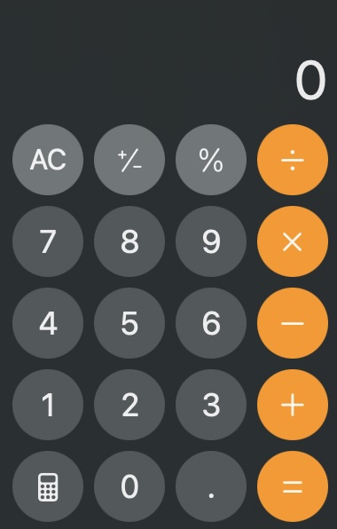

# calculator

## calculator.core

It MUST be able to add, subtract, divide, and multiply correctly.
It MUST allow the user to clear the output.

## calculator.ux

It MUST look and feel like the calculator on macOS. Ignore the buttons that aren't needed.

## calculator.dx

It MUST use TypeScript.
It MUST be simple to run. For example, `bun dev`
It MAY use lightweight library dependencies.
